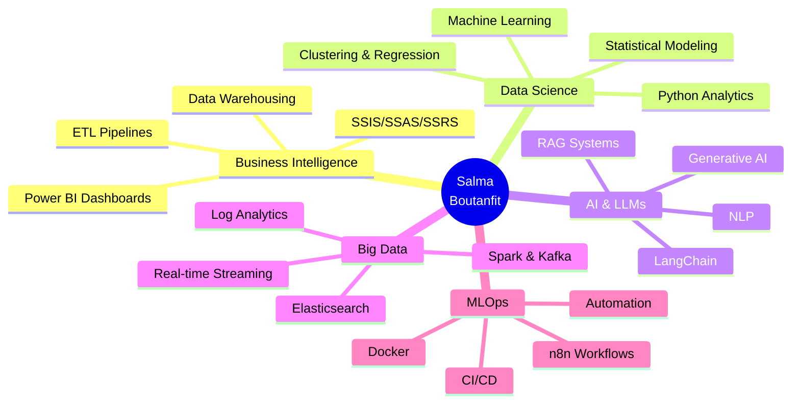

<div align="center">

# 👋 Salma Boutanfit

### 🎓 Data Science & Business Intelligence Engineer Student | ENSIAS Rabat

[](https://linkedin.com/in/salma-boutanfit)
[](mailto:boutanfitsalma1@gmail.com)
[]()

</div>

---

## 🚀 À propos

Élève ingénieure en Business Intelligence & Analytics à l'ENSIAS, passionnée par la **Data Science**, l'**IA générative** et l'**analyse décisionnelle**. 

🔍 **Actuellement à la recherche d'un stage PFE (4-6 mois)** à partir de **février 2026** en Data Science, BI ou IA.

💡 J'ai développé des solutions complètes allant de **chatbots RAG** pour l'administration fiscale à des **pipelines MLOps automatisés**, en passant par des **entrepôts décisionnels** et des **systèmes de monitoring temps réel**.

---

## 🛠️ Stack Technique

### 💾 Data & Databases


### 📊 Business Intelligence


### 🤖 AI & Machine Learning


### ⚡ Big Data & Streaming


### 🐳 DevOps & MLOps


---

## 💼 Expériences Professionnelles

### 🏛️ Direction Générale des Impôts (DGI)
**Stagiaire Data Science & IA** | Juillet - Septembre 2025 | Rabat
- Développement d'un **chatbot RAG intelligent** pour faciliter la consultation du Code Général des Impôts
- Pipeline complet : OCR, chunking, extraction de tableaux, indexation vectorielle
- Déploiement **Docker** avec ChromaDB et FastAPI
- **Technologies** : Python, LangChain, ChromaDB, OpenRouter, Docker

### 💧 Office National de l'Eau Potable (ONEE)
**Stagiaire Data Analyst** | Juillet - Août 2024 | Rabat
- Analyse de **6000+ enregistrements** de la plateforme Khadamat
- Création de **tableaux de bord Power BI** pour le suivi opérationnel IT
- Métriques : temps de résolution, taux d'escalade, gestion des urgences
- **Technologies** : Power BI, DAX, Excel, Python

---

## 🎯 Projets Phares

### 🤖 [Assistant Fiscal Intelligent - RAG Chatbot](https://github.com/Boutanfitsalma/moroccan-fiscal-rag-chatbot)
```
Production-ready RAG chatbot for Moroccan Tax Administration
Multilingual (FR/AR) | FastAPI + LangChain + ChromaDB | Dockerized
```
**Impact** : Réduction de 70% du temps de recherche documentaire

### 📊 [ELK Stack + ML - Firefox Build Monitoring](https://github.com/Boutanfitsalma/firefox-build-log-monitoring-elk)
```
Real-time log monitoring pipeline with anomaly detection
Elasticsearch ML | Kibana Dashboards | Docker orchestration
```
**Impact** : Détection automatique d'anomalies sur 10K+ builds/jour

### 🏢 [EvalLLM - Data Warehouse](https://github.com/Boutanfitsalma/Data-Warehouse-LLM-Benchmark)
```
Star schema data warehouse analyzing 4500+ LLM evaluations
ETL pipelines | SSIS/SSAS/SSRS | Power BI dashboards | SCD Type 2
```
**Impact** : Support à la décision pour choix de modèles LLM

### 🚀 [YouTube MLOps Pipeline](https://github.com/Boutanfitsalma/YouTube-MLOps-analysis-pipeline)
```
Automated sentiment analysis pipeline with agentic AI
n8n orchestration | HuggingFace NLP | WhatsApp triggers | Gmail reports
```
**Impact** : Analyse automatisée de milliers de commentaires

### 🛒 [E-commerce Analytics - Olist](https://github.com/Boutanfitsalma/ecommerce-ml-analysis)
```
Multi-table data processing with clustering & regression
Pandas | Scikit-learn | Hierarchical clustering | Linear regression
```
**Impact** : Identification de patterns de délais de livraison

### 📈 [ONEE Service Center Dashboard](https://github.com/Boutanfitsalma/ONEE-Service-Center-Analytics)
```
Operational BI dashboard for IT service performance
Power BI | DAX measures | KPI tracking
```
**Impact** : Visualisation temps réel de 6000+ tickets

---

## 🎓 Certifications

🏅 **Senior Data Scientist Career Track** - 365 Data Science (Nov 2025)  
🏅 **Associate Data Analyst** - DataCamp (Juin 2025)  
🏅 **Data Warehousing Concepts** - DataCamp (Avril 2025)

📚 **En cours** : Google Cloud Platform (GCP) | Microsoft Azure | AWS

---

## 📊 GitHub Stats

<div align="center">


</div>

---

## 🌟 Domaines d'Expertise



---

## 💬 Langues

🇲🇦 **Arabe** - Natif  
🇫🇷 **Français** - Courant  
🇬🇧 **Anglais** - Courant

---

## 🤝 Engagement Associatif

🎗️ **Responsable cellule dons** - Club CINDH ENSIAS  
📚 **Soutien scolaire** pour enfants en situation difficile  
👨‍🏫 **Formations estivales** pour élèves de classes préparatoires

---

## 📫 Me Contacter

<div align="center">

**🔍 Disponible pour un stage PFE de 4-6 mois à partir de février 2026**

[](mailto:boutanfitsalma1@gmail.com)
[](https://linkedin.com/in/salma-boutanfit)
[](tel:+212629239131)

📍 **Casablanca, Rabat, Mohammedia - Maroc**

</div>

---

<div align="center">

### ⭐ Si mes projets vous intéressent, n'hésitez pas à les explorer !


</div>
