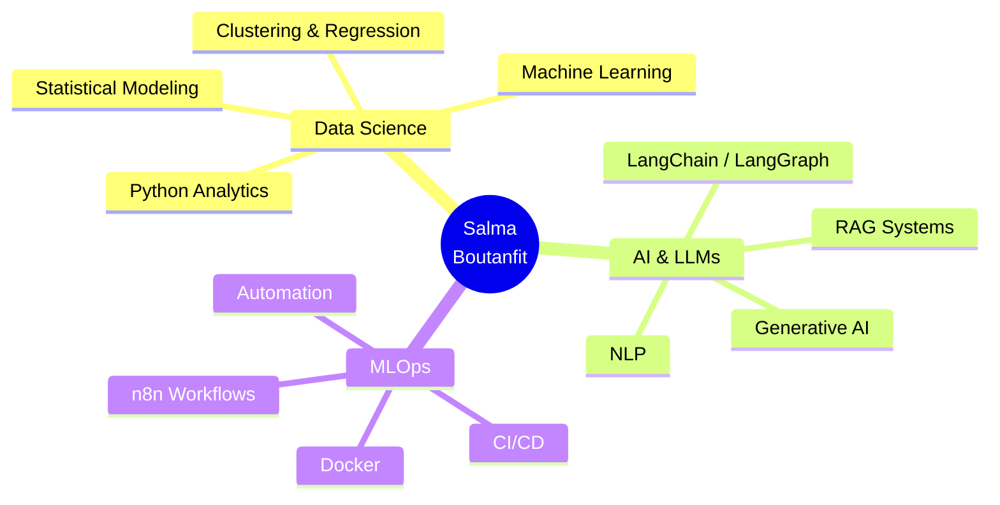

<div align="center">

# 👋 Salma Boutanfit

### Data Scientist & AI Engineer | Diplômée ENSIAS Rabat (Promotion 2026)

[](https://linkedin.com/in/salma-boutanfit)
[](mailto:boutanfitsalma1@gmail.com)
[](https://boutanfitsalma.github.io/portfolio/)


</div>

---

## À propos

Ingénieure diplômée de l'ENSIAS (promotion 2026), spécialisée en Data Science et Intelligence Artificielle. Disponible pour un CDI/CDD dès le 24 août 2026.

Passionnée par la Data Science, l'IA générative et les systèmes multi-agents, j'ai développé des solutions de bout en bout allant d'assistants conversationnels basés sur RAG pour l'administration publique à des systèmes multi-agents pour le secteur financier, ainsi que des pipelines d'automatisation et d'analyse de données.

🔗 **[Explorez tous mes projets →](https://github.com/Boutanfitsalma?tab=repositories)**

---

##  Stack Technique

<table>
<tr>
<td width="50%" valign="top">

### Data & Databases
<p align="center">
  
  
  
  
</p>

### Business Intelligence
<p align="center">
  
  
  
  
</p>

</td>
<td width="50%" valign="top">

### AI & Machine Learning
<p align="center">
  
  
  
  
</p>

### DevOps & MLOps
<p align="center">
  
  
  
</p>

</td>
</tr>
</table>

---

##  Expériences Professionnelles

### Maroclear - Data Scientist & AI Engineer (Stage de fin d'études)
**Février – Août 2026 (6 mois)** | Casablanca

Conception et déploiement d'un **système multi-agents conversationnel** pour le dépositaire central des valeurs mobilières du Maroc. Le système orchestre **5 agents spécialisés** via LangGraph pour couvrir deux périmètres distincts : portail public et espace privé affiliés.

- **Agent Orchestrateur** : routage intelligent des requêtes, gestion du contexte et de la mémoire conversationnelle, coordination des agents spécialisés
- **Agent RAG Général** : répond aux questions institutionnelles (missions, services, glossaire financier) via retrieval hybride sur ChromaDB + glossaire métier CSV
- **Agent RAG Réglementaire** : conseiller juridique sur le Recueil AMMC (857 pages), Dahirs, Règlement Général - couverture de 5 thématiques réglementaires (dépositaire central, OPCVM, APE, LBC-FT, sanctions)
- **Agent Classification** : identification automatique Incident / Demande / Réclamation - benchmark de 3 approches (ML supervisé, Zero-Shot LLM, Few-Shot hybride), régression logistique retenue
- **Agent Auto-fill** : extraction conversationnelle des champs structurés, pré-remplissage automatique des formulaires MyMaroclear (incidents, demandes, réclamations)
- Architecture sécurisée : LLM local (Ollama), zéro exposition externe, conformité infrastructure financière critique - déploiement Docker production

**Technologies :** Python, LangChain, LangGraph, RAG, ChromaDB, Ollama (Local LLM), OpenRouter, FastAPI, React, Docker

---

###  Direction Générale des Impôts (DGI) - [Assistant Fiscal Intelligent - RAG Chatbot](https://github.com/Boutanfitsalma/moroccan-fiscal-rag-chatbot)
**Juillet – Septembre 2025 (3 mois)** | Rabat

- Conception et déploiement d'un **chatbot multilingue FR/AR** basé RAG pour accès conversationnel à la documentation fiscale
- **Pipeline complet OCR + NLP** : extraction de 1 240+ documents scannés historiques, chunking intelligent, vectorisation sémantique, indexation optimisée, retrieval augmenté en production
- Déploiement dockerisé : latence < 5 secondes, haute disponibilité, robustesse sur requêtes multi-documents complexes 
**Technologies :** Python, LangChain, FastAPI, ChromaDB, OpenRouter, Docker, RAG Pipeline, OCR, NLP

---

###  Office National de l'Eau Potable (ONEE) - [ONEE Service Center Dashboard](https://github.com/Boutanfitsalma/ONEE-Service-Center-Analytics)
**Juillet – Août 2024 (2 mois)** | Rabat

- Analyse exploratoire et préparation de **6 000+ enregistrements** de la plateforme Khadamat : nettoyage, transformation, feature engineering
- Conception de **10+ KPIs opérationnels** : MTTR, taux d'escalade, détection d'urgences critiques, analyse de tendances
- Développement de **tableaux de bord Power BI** pour la visualisation de la performance IT et l'aide à la décision

**Technologies :** Python (Pandas, NumPy), Power BI, DAX, SQL

---

##  Projets Académiques

###  [ELK Stack + ML - Firefox Build Monitoring](https://github.com/Boutanfitsalma/firefox-build-log-monitoring-elk)
```
Real-time log monitoring pipeline with anomaly detection
Elasticsearch ML | Kibana Dashboards | Docker orchestration
```
**Impact** : Détection automatique d'anomalies sur 10 000+ builds/jour

---

###  [EvalLLM - Data Warehouse](https://github.com/Boutanfitsalma/Data-Warehouse-LLM-Benchmark)
```
Star schema data warehouse analyzing 4500+ LLM evaluations
ETL pipelines | SSIS/SSAS/SSRS | Power BI dashboards | SCD Type 2
```
**Impact** : Support à la décision pour le choix de modèles LLM

---

###  [YouTube MLOps Pipeline](https://github.com/Boutanfitsalma/YouTube-MLOps-analysis-pipeline)
```
Automated sentiment analysis pipeline with agentic AI
n8n orchestration | HuggingFace NLP | WhatsApp triggers | Gmail reports
```
**Impact** : Analyse automatisée de milliers de commentaires

---

###  [E-commerce Analytics - Olist](https://github.com/Boutanfitsalma/ecommerce-ml-analysis)
```
Multi-table data processing with clustering & regression
Pandas | Scikit-learn | Hierarchical clustering | Linear regression
```
**Impact** : Identification de patterns de délais de livraison

---

###  [Hospital Pharmaceutical Management Dashboard](https://github.com/Boutanfitsalma/pharma-management-dashboard)
```
Strategic BI dashboard for medication management at CHU Mohammed VI
Power BI | Power Query | DAX | What-if analysis
```
**Impact** : Optimisation de la gestion pharmaceutique pour 10+ services hospitaliers

---

## 🎓 Certifications

 **AI Agent Architecture** - 365 Data Science (Mars 2026)

 **Designing Agentic Systems with LangChain** - DataCamp (Mars 2026)

 **Senior Data Scientist Career Track** - 365 Data Science (Novembre 2025)

 **Associate Data Analyst** - DataCamp (Juin 2025)

 **Data Warehousing Concepts** - DataCamp (Avril 2025)

 **Introduction to NoSQL** - DataCamp (Avril 2025)

 **Containerization and Virtualization Concepts** - DataCamp (Avril 2025)

 **En cours** : Microsoft Azure | AWS

---

##  Domaines d'Expertise


```mermaid
mindmap
  root((Salma<br/>Boutanfit))
    Data Science
      Machine Learning
      Python Analytics
      Statistical Modeling
      Clustering & Regression
    AI & LLMs
      RAG Systems
      LangChain / LangGraph
      Generative AI
      NLP
    MLOps
      Docker
      CI/CD
      Automation
      n8n Workflows
```

---

## 💬 Langues

🇲🇦 **Arabe** - Natif
🇫🇷 **Français** - Courant
🇬🇧 **Anglais** - Courant

---

## 🤝 Engagement Associatif

🤲 **Responsable cellule dons** - Club CINDH ENSIAS
📚 **Soutien scolaire** pour enfants en situation difficile
🎓 **Formations estivales** pour élèves de classes préparatoires

---

## 📫 Me Contacter

<div align="center">

[](mailto:boutanfitsalma1@gmail.com)
[](https://linkedin.com/in/salma-boutanfit)
[](tel:+212629239131)

📍 **Casablanca, Rabat, Mohammedia - Maroc**

</div>

---

<div align="center">

### ⭐ Merci pour votre visite ! N'hésitez pas à explorer mes projets ou à me contacter pour échanger autour de la Data Science et de l'IA.

</div>
