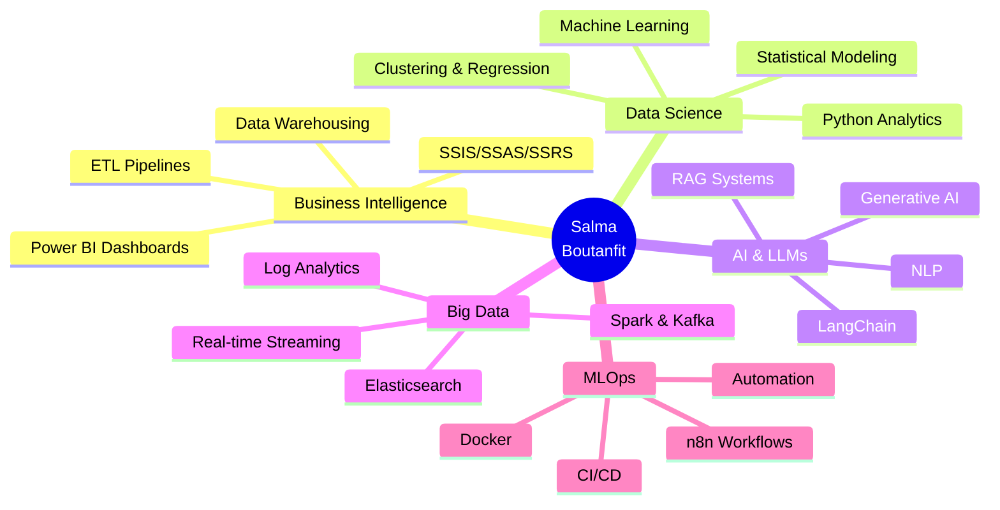

<div align="center">

# 👋 Salma Boutanfit

### 🎓 Data Science & Business Intelligence Engineer Student | ENSIAS Rabat

[](https://linkedin.com/in/salma-boutanfit)
[](mailto:boutanfitsalma1@gmail.com)
[](https://boutanfitsalma.github.io/portfolio/)


</div>

---

##  À propos

Élève ingénieure en Business Intelligence & Analytics à l'ENSIAS, passionnée par la **Data Science**, l'**IA générative** et l'**analyse décisionnelle**. 

 J'ai développé des solutions complètes allant de **chatbots RAG** pour l'administration fiscale à des **pipelines MLOps automatisés**, en passant par des **entrepôts décisionnels** et des **systèmes de monitoring temps réel**.

🔗 **[Explorez tous mes projets →](https://github.com/Boutanfitsalma?tab=repositories)**
---

## 🛠️ Stack Technique

<table>
<tr>
<td width="50%" valign="top">

###  Data & Databases
<p align="center">
  
  
  
  
</p>

###  Business Intelligence
<p align="center">
  
  
  
  
</p>

###  AI & Machine Learning
<p align="center">
  
  
  
  
</p>

</td>
<td width="50%" valign="top">

###  Big Data & Streaming
<p align="center">
  
  
  
</p>

###  DevOps & MLOps
<p align="center">
  
  
  
</p>

###  Cloud (en cours)
<p align="center">
  
  
  
</p>

</td>
</tr>
</table>
---

## 💼 Expériences Professionnelles

###  Direction Générale des Impôts (DGI) -  [Assistant Fiscal Intelligent - RAG Chatbot](https://github.com/Boutanfitsalma/moroccan-fiscal-rag-chatbot)
**Stagiaire Data Science & IA** | Juillet - Septembre 2025 | Rabat
- Développement d'un **chatbot RAG intelligent** pour faciliter la consultation du Code Général des Impôts
- Pipeline complet : OCR, chunking, extraction de tableaux, indexation vectorielle
- Déploiement **Docker** avec ChromaDB et FastAPI
- **Technologies** : Python, LangChain, ChromaDB, OpenRouter, Docker

###  Office National de l'Eau Potable (ONEE) - [ONEE Service Center Dashboard](https://github.com/Boutanfitsalma/ONEE-Service-Center-Analytics)
**Stagiaire Data Analyst** | Juillet - Août 2024 | Rabat
- Analyse de **6000+ enregistrements** de la plateforme Khadamat
- Création de **tableaux de bord Power BI** pour le suivi opérationnel IT
- Métriques : temps de résolution, taux d'escalade, gestion des urgences
- **Technologies** : Power BI, DAX, Excel, Python

---

##   Projets Académiques

###  [ELK Stack + ML - Firefox Build Monitoring](https://github.com/Boutanfitsalma/firefox-build-log-monitoring-elk)
```
Real-time log monitoring pipeline with anomaly detection
Elasticsearch ML | Kibana Dashboards | Docker orchestration
```
**Impact** : Détection automatique d'anomalies sur 10K+ builds/jour

###  [EvalLLM - Data Warehouse](https://github.com/Boutanfitsalma/Data-Warehouse-LLM-Benchmark)
```
Star schema data warehouse analyzing 4500+ LLM evaluations
ETL pipelines | SSIS/SSAS/SSRS | Power BI dashboards | SCD Type 2
```
**Impact** : Support à la décision pour choix de modèles LLM

###  [YouTube MLOps Pipeline](https://github.com/Boutanfitsalma/YouTube-MLOps-analysis-pipeline)
```
Automated sentiment analysis pipeline with agentic AI
n8n orchestration | HuggingFace NLP | WhatsApp triggers | Gmail reports
```
**Impact** : Analyse automatisée de milliers de commentaires

###  [E-commerce Analytics - Olist](https://github.com/Boutanfitsalma/ecommerce-ml-analysis)
```
Multi-table data processing with clustering & regression
Pandas | Scikit-learn | Hierarchical clustering | Linear regression
```
**Impact** : Identification de patterns de délais de livraison

###  [Hospital Pharmaceutical Management Dashboard](https://github.com/Boutanfitsalma/pharma-management-dashboard)

```
Strategic BI dashboard for medication management at CHU Mohammed VI 
Power BI | Power Query | DAX | What-if analysis
```
**Impact** : Optimisation de la gestion pharmaceutique pour 10+ services hospitaliers


## 🎓 Certifications

🏅 **Senior Data Scientist Career Track** - 365 Data Science (Novembre 2025)

🏅 **Associate Data Analyst** - DataCamp (Juin 2025)  

🏅 **Data Warehousing Concepts** - DataCamp (Avril 2025)

🏅 **Introduction to NoSQL** - DataCamp, Avril 2025

🏅**Containerization and Virtualization Concepts** - DataCamp, Avril 2025

📚 **Formation En cours** : Google Cloud Platform (GCP) | Microsoft Azure | AWS

---

## 📊 GitHub Stats

<div align="center">


</div>

---

## 🌟 Domaines d'Expertise


```mermaid
mindmap
  root((Salma<br/>Boutanfit))
    Business Intelligence
      Data Warehousing
      ETL Pipelines
      Power BI Dashboards
      SSIS/SSAS/SSRS
    Data Science
      Machine Learning
      Python Analytics
      Statistical Modeling
      Clustering & Regression
    AI & LLMs
      RAG Systems
      LangChain
      Generative AI
      NLP
    Big Data
      Elasticsearch
      Spark & Kafka
      Real-time Streaming
      Log Analytics
    MLOps
      Docker
      CI/CD
      Automation
      n8n Workflows
```

---

## 💬 Langues

🇲🇦 **Arabe** - Natif  
🇫🇷 **Français** - Courant  
🇬🇧 **Anglais** - Courant

---

## 🤝 Engagement Associatif

 **Responsable cellule dons** - Club CINDH ENSIAS  
 **Soutien scolaire** pour enfants en situation difficile  
 **Formations estivales** pour élèves de classes préparatoires

---

## 📫 Me Contacter

<div align="center">


[](mailto:boutanfitsalma1@gmail.com)
[](https://linkedin.com/in/salma-boutanfit)
[](tel:+212629239131)

📍 **Casablanca, Rabat, Mohammedia - Maroc**

</div>

---

<div align="center">

### ⭐ Si mes projets vous intéressent, n'hésitez pas à les explorer !


</div>
